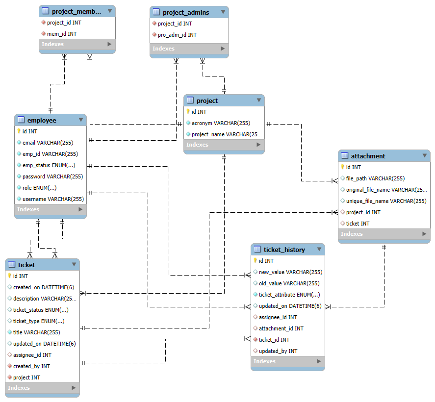

# 📋 Project Management System

Project Management System is a backend-only project built with **Spring Boot**, inspired by **Jira**.

---

## 📑 Table of Contents

1. [x] [Introduction](#introduction)
2. [x] [Feature](#feature)
3. [x] [Tech Stack](#tech-stack)
4. [x] [Prerequisites](#prerequisites)
5. [x] [Getting Started](#getting-started)
6. [x] [ERD Data Model](#erd-data-model)
7. [x] [Project Flow](#project-flow)
8. [x] [API Documentation](#api-documentation)
9. [x] [Future Scope](#future-scope)
10. [x] [Contribution](#contribution)
11. [x] [License](#license)

---

<h2 id="introduction">🧭 Introduction</h2>

This project is ticket based Project Management Application, implemented purely as a backend service.
It supports role-based access control, and a clean as well as secured API layer. Designed to demonstrate backend development, API design, and documentation practices.
- Role-based access control (Admin, Manager, User)
- Ticket lifecycle management
- Project membership and authorization
- API-first development with thorough documentation

---

<h2 id="feature">✨ Feature</h2>

- ✅ Project and ticket management APIs
- ✅ RBAC: Admin, Manager, User
- ✅ Ticket assignment & status updates
- ✅ Add/remove project participants
- ✅ Validation & error handling
- ✅ Database persistence via JPA
- ✅ File handling

---

<h2 id="tech-stack">🧰 Tech Stack</h2>

### 🔙 Backend (Spring Boot)

- Spring Web, Spring Security
- Spring Data JPA as ORM tool
- MySQL Database
- JWT (JSON Web Token) based authentication
- Lombok for boilerplate reduction

### 📂 File Handling

- Spring MVC Multipart support
- Files stored in local disk (customizable via properties file)

---

<h2 id="prerequisites">🔧 Prerequisites</h2>

- **Java JDK 17+**
- **Maven**
- **MySQL Server**
- **PostMan or API testing tool**

---

<h2 id="getting-started">🚀 Getting Started</h2>

### 1️⃣ Clone Repo

```bash
git clone https://github.com/AnbuGanesanB/Project-Management-System.git
cd Project-Management-System
```

### 2️⃣ Configure Application

#### ⚙️ Application Profiles

This project supports multiple **Spring profiles** for different environments:

- **`dev`** → Local development 
- **`test`** → Test profile (currently set in `application.properties`)

#### 🔑 Important Note

By default, the app runs with the **`test` profile** because of this property in `application.properties`:

```properties
spring.profiles.active=test
```

If you want to run with a different profile (e.g., `dev`):

**Edit `application.properties`**

   ```properties
   spring.profiles.active=dev
   ```

👉 **Tip:** Ensure that your chosen profile has a corresponding `application-{profile}.properties` file (e.g., `application-dev.properties`, `application-test.properties`) with correct DB URL and credentials.


- Update your **MySQL username/password**
- Ensure the **JDBC URL uses the correct port** (default set to `3307`, but verify your MySQL installation)
  ```
  spring.datasource.url=jdbc:mysql://localhost:3307/ProjectManagementApp
  ```
As this project is for demonstration purpose, JWT Keys are also shared

### 3️⃣ Run Backend
Ensure you are in the `Project-Management-System` folder to start
```bash
mvn spring-boot:run
```

Note:
Upon startup, The Initial user 'Admin' credential will be shared on console. Please utilise this to start explore the application

Backend starts at **Port:8080**.

---

<h2 id="erd-data-model">🛢️ ERD Data Model</h2>



### Structure

* Application has three main entities Employee, Project, Ticket
* Project_Admin, Project_Member both are join tables between Employee and Project
* Attachment is common to Ticket and Project
* Ticket is child to Project entity
* Ticket History is child to Ticket entity

---

<h2 id="project-flow">🔄 Project Flow</h2>

### Employee 
* Admin is responsible for Employee management. Creates and Updates the employees.
* Admin has superior access, as admin don't necessarily need to be a participant for any action.

### Project
* Project can be created by Admin and Manager.
* Project further has two roles Project_Admin and Project_Member, called participants.
* Certain Manager functionalities are allowed only if the employee is participant of project.
* Project will have attachments.
* Tickets will be created under the Project.
* Deleting the project will delete related tickets and attachments.

### Ticket
* Tickets can be created by anyone (particularly by participants).
* Tickets will have many factors like Status, Type, Title, etc.
* Any update on ticket will create a new Ticket history.
* Tickets will also have attachments.
* Deleting a Ticket will delete related attachments and its history.

**Note:** Please refer the API documentation for detailed insight

---

<h2 id="api-documentation">📖 API Documentation</h2>

The complete API documentation (with multiple request/response examples) is published via **Postman**:

👉 [View API Documentation](https://documenter.getpostman.com/view/47323157/2sB3BGGpCH)

### Features

- Organized by module (Projects, Tickets, Users, etc.)
- Multiple request/response examples for different scenarios
- Publicly accessible (no Postman account required)

### Alternative: Import into Postman

You can also import the collection directly:

1. Open Postman → **Import**
2. select file from `Project-Management-System/Reference Docs/Project Management App.postman_collection.json`
3. The entire collection (with examples) will be available locally.

---

<h2 id="future-scope">🔮 Future Scope</h2>

- Front end UI development
- Add sprint management
- Backlogs management
- Notification system
- Have Scrum / Kanban boards

---

<h2 id="contribution">🙌 Contribution</h2>

This is a personal project meant for learning and showcasing skills, but feel free to fork and experiment.

---

<h2 id="license">📄 License</h2>

MIT — Free to use for demos and learning.